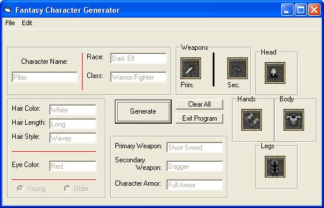



## Character Generator2

### Description

Basically the same as my old Character Generator except for these added things:

*Pictures - character's weapons and armor are showed

*Gnome names now work

*Only one form - no more trouble with all the extra form as before

----

Enjoy!
 
### More Info
 

             |
---                |---
**Submitted On**   |2003-02-02 11:26:34
**By**             |[Eldagor Aranfuin](https://github.com/Planet-Source-Code/PSCIndex/blob/master/ByAuthor/eldagor-aranfuin.md)
**Level**          |Beginner
**User Rating**    |4.3 (13 globes from 3 users)
**Compatibility**  |VB 6\.0
**Category**       |[Games](https://github.com/Planet-Source-Code/PSCIndex/blob/master/ByCategory/games__1-38.md)
**World**          |[Visual Basic](https://github.com/Planet-Source-Code/PSCIndex/blob/master/ByWorld/visual-basic.md)
**Archive File**   |[Character\_153829222003\.zip](https://github.com/Planet-Source-Code/eldagor-aranfuin-character-generator2__1-42893/archive/master.zip)

